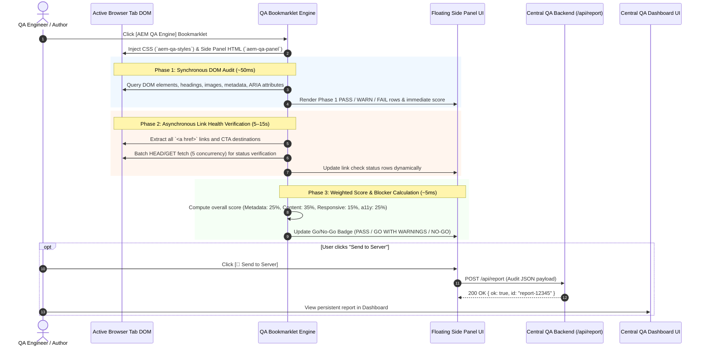

# AEM QA Framework — Technical Architecture & Complete Documentation Guide

**Document Version:** 1.0.0  
**Last Updated:** August 2026  
**Status:** Production Ready  
**Primary Author:** AEM QA Core Engineering Team  
**Target Audience:** QA Engineers, AEM Developers, Release Managers, Content Authors  

---

## 📋 Table of Contents

1. [Executive Summary & Problem Statement](#1-executive-summary--problem-statement)
2. [System Architecture & Execution Flow](#2-system-architecture--execution-flow)
3. [The 52-Check 4-Pillar Reference Matrix](#3-the-52-check-4-pillar-reference-matrix)
4. [Bookmarklet Engine & Build System](#4-bookmarklet-engine--build-system)
5. [Backend API & Reporting Server](#5-backend-api--reporting-server)
6. [Central Dashboard Web Application](#6-central-dashboard-web-application)
7. [Customization & Site Adaptation Guide](#7-customization--site-adaptation-guide)
8. [CI/CD Integration & Future Roadmap](#8-cicd-integration--future-roadmap)

---

## 1. Executive Summary & Problem Statement

### 1.1 The Challenge with Testing AEM Author & Preview Environments
Adobe Experience Manager (AEM as a Cloud Service and AEM 6.5) protects authoring preview environments (`author-pXXXX-eYYYY.adobeaemcloud.com`) behind **Adobe Identity Management System (IMS)** SAML authentication. Traditional automated testing tools encounter severe operational roadblocks:

- **Headless Browsers & CLI Scrapers** (Playwright, Cypress, Lighthouse CLI): Direct headless requests fail at the Adobe IMS login wall. Setting up automated test credentials requires complex OAuth flow handshakes, cookie sharing, or IP whitelisting.
- **External Proxy & CORS Restrictions**: Fetching author pages from external web tools triggers Cross-Origin Resource Sharing (CORS) security blocks.
- **Manual Authoring Errors**: Content authors frequently push pages containing raw `/content/...html` links, stage/dev URLs, missing heading hierarchies, or missing image `alt` attributes.

### 1.2 The Solution: Browser-Native Bookmarklet QA Engine
The **AEM QA Framework** solves these challenges by running directly inside the user's active, authenticated browser tab as a **Javascript Bookmarklet**. 

> [!NOTE]
> Because the bookmarklet executes in the context of the active tab, it natively inherits all Adobe IMS authentication cookies, session headers, and preview permissions without requiring API keys, credentials, or network proxies.

```
┌─────────────────────────────────────────────────────────────────────────────┐
│                            ACTIVE BROWSER TAB                               │
│  ┌───────────────────────────────┐     ┌─────────────────────────────────┐  │
│  │ Authenticated AEM Preview DOM │ ◄───┤  AEM QA Bookmarklet (Vanilla JS)│  │
│  └──────────────┬────────────────┘     └────────────────┬────────────────┘  │
└─────────────────┼───────────────────────────────────────┼───────────────────┘
                  │ Read DOM / Fetch links                │ POST Report JSON
                  ▼                                       ▼
┌───────────────────────────────────┐     ┌───────────────────────────────────┐
│     52 Automated Audit Checks     │     │     Central QA Dashboard Server   │
│ (Metadata, Content, a11y, Visual) │     │      (Local Server or Railway)       │
└───────────────────────────────────┘     └───────────────────────────────────┘
```

---

## 2. System Architecture & Execution Flow

### 2.1 Technical Stack & Dependencies
- **Core Engine**: Pure Vanilla JavaScript (ES5/ES6 compatible).
- **Styling**: Zero CSS framework dependencies. Isolated CSS injected via shadow/prefixed stylesheet.
- **Backend API**: Zero npm dependencies. Native Node.js `http` module, run locally or on Railway.
- **Dashboard**: Plain HTML5, Vanilla CSS3 (Dark Theme), and ES6 Fetch API.

### 2.2 End-to-End Execution Sequence



---

## 3. The 52-Check 4-Pillar Reference Matrix

The framework evaluates pages across **4 core pillars**, applying weighted scoring logic and flagging **P1 Hard Blockers** that prohibit production publication.

### 3.1 Pillar Weighting & Scoring Formula

$$\text{Overall Score} = (S_{\text{meta}} \times 0.25) + (S_{\text{content}} \times 0.35) + (S_{\text{responsive}} \times 0.15) + (S_{\text{a11y}} \times 0.25)$$

- **GO Status**: Overall Score $\ge 80\%$ AND Zero P1 Hard Blockers.
- **GO WITH WARNINGS**: Overall Score $\ge 80\%$ WITH P2 Warnings.
- **NO-GO (Hard Block)**: Overall Score $< 80\%$ OR Any P1 Hard Blocker present.

---

### 3.2 Pillar 1: Metadata & SEO Audit (25% Weight)

| Check ID | Check Name | Severity | Rule / Validation Logic |
|---|---|---|---|
| `meta-title-exists` | Page Title Present | **P1 Blocker** | `<title>` tag must exist and contain non-whitespace text. |
| `meta-title-length` | Page Title Length | P2 Warning | Title length should be between 30 and 60 characters for optimal SERP display. |
| `meta-desc-exists` | Meta Description Present | **P1 Blocker** | `<meta name="description">` must exist with non-empty content. |
| `meta-desc-length` | Meta Description Length | P2 Warning | Description length should be between 70 and 160 characters. |
| `meta-canonical` | Canonical URL Present | P2 Warning | `<link rel="canonical">` tag must exist and point to an absolute URL. |
| `meta-robots` | Robots Tag Audit | P2 Warning | Check `<meta name="robots">` for unintended `noindex` or `nofollow` on production. |
| `meta-og-title` | OpenGraph Title | P2 Warning | `<meta property="og:title">` must exist. |
| `meta-og-desc` | OpenGraph Description | P2 Warning | `<meta property="og:description">` must exist. |
| `meta-og-image` | OpenGraph Image | P2 Warning | `<meta property="og:image">` must exist and be an absolute valid image URL. |
| `meta-og-url` | OpenGraph URL | Info | `<meta property="og:url">` present and matches canonical. |
| `meta-twitter-card` | Twitter Card Tag | Info | `<meta name="twitter:card">` specified (e.g. `summary_large_image`). |
| `meta-viewport` | Viewport Tag Present | **P1 Blocker** | `<meta name="viewport">` must exist in `<head>`. |
| `meta-charset` | Character Encoding | P2 Warning | `<meta charset="UTF-8">` defined within the first 1024 bytes of document. |

---

### 3.3 Pillar 2: Content & Component Integrity (35% Weight)

| Check ID | Check Name | Severity | Rule / Validation Logic |
|---|---|---|---|
| `content-h1-single` | Exactly One H1 Tag | **P1 Blocker** | Page must contain exactly one `<h1>` element. 0 or >1 triggers P1 failure. |
| `content-heading-order` | Logical Heading Hierarchy | P2 Warning | Headings must not skip levels (e.g., `<h1>` followed directly by `<h3>`). |
| `content-raw-paths` | Raw `/content/` Path Leak | **P1 Blocker** | No `<a href>` should contain unshortened internal paths starting with `/content/...html`. |
| `content-env-leak` | Author/Stage Domain Leak | **P1 Blocker** | Links/images must not reference author (`author-p*`), stage, or dev domains. |
| `content-broken-links` | Internal Link Health | **P1 Blocker** | Asynchronously verifies internal links return HTTP 200/301/302 (Not 404/500). |
| `content-cta-health` | CTA Button Health | **P1 Blocker** | All CTA destination URLs must be reachable and non-broken. |
| `content-image-alt` | Image Alt Attributes | P2 Warning | All content `` tags must have an `alt` attribute (decorative images require `alt=""`). |
| `content-empty-links` | Empty Anchor Tags | P2 Warning | `<a href>` elements must contain accessible text or child aria-label. |
| `content-generic-cta` | Generic CTA Text Audit | Info | Flags vague CTA labels like "click here", "read more", or "learn more". |
| `content-lorem-ipsum` | Placeholder Text Check | **P1 Blocker** | Page body text scanned for "Lorem ipsum", "TODO", or draft placeholder text. |
| `content-broken-images` | Broken Image Src | **P1 Blocker** | Checks `naturalWidth > 0` for rendered images. |
| `content-duplicate-ids` | Unique Element IDs | P2 Warning | Verifies all DOM element `id` attributes are unique on the page. |
| `content-target-blank` | Secure External Links | P2 Warning | `<a target="_blank">` links should include `rel="noopener noreferrer"`. |
| `content-empty-paragraphs` | Empty Paragraph Tags | Info | Scans for empty `<p></p>` tags used incorrectly for spacing. |
| `content-table-headers` | Table Header Structure | P2 Warning | Data `<table>` elements must include `<th>` headers. |

---

### 3.4 Pillar 3: Responsive & Visual Layout (15% Weight)

| Check ID | Check Name | Severity | Rule / Validation Logic |
|---|---|---|---|
| `resp-viewport-scalable` | User Scalability | P2 Warning | Viewport meta must not disable zoom (`user-scalable=no` or `maximum-scale=1.0`). |
| `resp-horiz-scroll` | Horizontal Overflow | **P1 Blocker** | Checks if `document.body.scrollWidth > window.innerWidth` (causes horizontal scrollbar). |
| `resp-touch-targets` | Minimum Touch Target Size | P2 Warning | Interactive buttons/links must be at least 44x44px on touch viewports. |
| `resp-font-size-min` | Minimum Legible Font Size | P2 Warning | Text elements must have a computed font-size $\ge 12\text{px}$. |
| `resp-image-responsive` | Responsive Image Tags | P2 Warning | High-res content images should utilize `srcset` or `<picture>` elements. |
| `resp-fixed-width` | Fixed Width Container Check | P2 Warning | Scans for hardcoded pixel widths (`width: 1200px`) breaking mobile viewports. |
| `resp-flex-wrap` | Flex Container Wrapping | Info | Verifies flex containers specify `flex-wrap: wrap` where appropriate. |
| `resp-media-queries` | Media Query Presence | Info | Validates stylesheet presence of responsive breakpoint rules. |
| `resp-overflow-hidden` | Unintentional Clipping | P2 Warning | Scans main content blocks for `overflow: hidden` cutting off content. |
| `resp-aspect-ratio` | Video Aspect Ratio | Info | Embed elements (`<iframe|video>`) maintain responsive aspect ratio wrappers. |

---

### 3.5 Pillar 4: Accessibility & ARIA Compliance (25% Weight)

| Check ID | Check Name | Severity | Rule / Validation Logic |
|---|---|---|---|
| `a11y-color-contrast` | Text Color Contrast | **P1 Blocker** | Normal text contrast ratio $\ge 4.5:1$, large text $\ge 3:1$ (WCAG AA). |
| `a11y-landmarks` | ARIA Landmark Regions | P2 Warning | Page must contain `<header|nav|main|footer>` or corresponding ARIA roles. |
| `a11y-form-labels` | Form Inputs Labeled | **P1 Blocker** | Every `<input|select|textarea>` must have an associated `<label>` or `aria-label`. |
| `a11y-focus-ring` | Focus Ring Visibility | P2 Warning | Interactive elements must not disable focus outline (`outline: none` without replacement). |
| `a11y-lang-attribute` | HTML Lang Attribute | **P1 Blocker** | `html` root element must specify a valid `lang` attribute (e.g., `<html lang="en">`). |
| `a11y-aria-valid` | Valid ARIA Attributes | P2 Warning | ARIA attributes (`aria-*`) must use valid specification names and valid values. |
| `a11y-button-name` | Accessible Button Names | P2 Warning | `<button>` elements must contain text content or `aria-label`. |
| `a11y-dialog-aria` | Modal Dialog Accessibility | P2 Warning | Dialog elements require `role="dialog"`, `aria-modal="true"`, and label references. |
| `a11y-skip-link` | Skip to Main Content Link | P2 Warning | Includes a visible/focusable "Skip to content" link as first interactive element. |
| `a11y-keyboard-access` | Keyboard Navigability | P2 Warning | All interactive custom components possess `tabindex="0"` or native focusability. |
| `a11y-img-alt-decorative` | Decorative Image Alt | Info | Purely decorative images use `alt=""` and `role="presentation"`. |
| `a11y-table-caption` | Data Table Captions | Info | Complex data tables include `<caption>` or `aria-describedby`. |
| `a11y-list-structure` | Semantic List Elements | P2 Warning | `<li>` elements must be contained directly inside `<ul>` or `<ol>`. |
| `a11y-audio-video-captions` | Video Caption Tracking | P2 Warning | `<video>` elements must include `<track kind="captions">`. |

---

## 4. Bookmarklet Engine & Build System

### 4.1 Master Engine Blueprint ([`bookmarklet.js`](../src/bookmarklet.js))
The bookmarklet script is wrapped in an Immediately Invoked Function Expression (IIFE) to isolate variable scope from the audited host page:

```javascript
(function () {
  'use strict';
  
  // Dynamic server url resolution
  var currentScriptTag = document.currentScript;
  var reportServerUrl = 'http://localhost:3500/report';
  if (currentScriptTag && currentScriptTag.src && currentScriptTag.src.indexOf('http') === 0) {
    reportServerUrl = new URL(currentScriptTag.src).origin + '/api/report';
  }

  var CONFIG = {
    version: '1.0.0',
    panelId: 'aem-qa-panel',
    thresholdScore: 80,
    linkBatchSize: 5,
    linkTimeout: 5000,
    reportServer: reportServerUrl,
    weights: { metadata: 0.25, content: 0.35, responsive: 0.15, accessibility: 0.25 }
  };
  
  // Prevent duplicate injection
  if (document.getElementById(CONFIG.panelId)) {
    document.getElementById(CONFIG.panelId).remove();
    return;
  }
  
  // Execution Steps: inject UI -> Phase 1 DOM checks -> Phase 2 Link check
})();
```

### 4.2 Build & Minification Pipeline
Because browsers restrict bookmarklet URLs to a single `javascript:...` string, the source JS file must be minified, URL-encoded, and formatted.

The framework provides a single build script, `scripts/build.js`, which emits all three payload variants:

1. **[`build-cloud-bookmarklet.js`](../scripts/build.js)**:
   - Encodes the bookmarklet to auto-detect its serving origin, or to post to a build-injected `/api/report` endpoint.
   - Output: [`AEM_QA_BOOKMARK.txt`](../dist/AEM_QA_BOOKMARK_HOSTED.txt) & [`AEM_QA_BOOKMARK_CLOUD.txt`](../dist/AEM_QA_BOOKMARK_LOADER.txt).

2. **[`build-bookmarklet.js`](../scripts/build.js)**:
   - Configured for local development targeting `http://localhost:3500/report`.
   - Output: [`AEM_QA_BOOKMARK_LOCAL.txt`](../dist/AEM_QA_BOOKMARK_LOCAL.txt).

3. **[`build-standalone.js`](../scripts/build.js)**:
   - Generates an offline self-contained bookmarklet payload that renders UI without requiring external server endpoints.
   - Output: [`AEM_QA_BOOKMARK_STANDALONE.txt`](../dist/AEM_QA_BOOKMARK_HOSTED.txt).

---

## 5. Backend API & Reporting Server

The backend receives JSON audit reports submitted by the bookmarklet side panel and serves the central analytics dashboard.

### 5.1 Architecture & Dual-Mode Hosting

```
                        ┌────────────────────────────────────────┐
                        │   Server Request Handler Selection    │
                        └───────────────────┬────────────────────┘
                                            │
                  ┌─────────────────────────┴─────────────────────────┐
                  ▼                                                   ▼
┌───────────────────────────────────┐               ┌───────────────────────────────────┐
│     Local Node HTTP Server        │               │   Railway (persistent Node)       │
│         (server.js)               │               │         (server.js)               │
│   • Runs on http://localhost:3500 │               │   • Deployed via railway.toml     │
│   • Serves static public/ assets  │               │   • Endpoint: /api/report         │
│   • In-memory report storage      │               │   • Serverless environment memory │
└───────────────────────────────────┘               └───────────────────────────────────┘
```

---

### 5.2 REST API Specifications

#### Endpoint 1: Submit Audit Report
- **URL**: `POST /api/report` (or `POST /report`)
- **Headers**: `Content-Type: application/json`
- **Request Body Payload**:
  ```json
  {
    "meta": {
      "url": "https://author-p12345-e67890.adobeaemcloud.com/content/site/en/home.html",
      "title": "Home Page | Brand",
      "overallScore": 92,
      "status": "PASS",
      "auditedAt": "2026-08-03T16:00:00.000Z"
    },
    "scores": {
      "metadata": 100,
      "content": 90,
      "responsive": 95,
      "accessibility": 88
    },
    "defects": [
      {
        "id": "content-raw-paths",
        "pillar": "content",
        "severity": "P1",
        "title": "Raw /content/ Path Leak",
        "message": "Found 1 link exposing unshortened /content/ path",
        "selector": "a.cta-link"
      }
    ]
  }
  ```
- **Response**: `200 OK`
  ```json
  {
    "ok": true,
    "id": "report-1722699600000-a1b2c",
    "message": "Report saved successfully!"
  }
  ```

---

#### Endpoint 2: List Audit History Summaries
- **URL**: `GET /api/reports`
- **Response**: `200 OK`
  ```json
  [
    {
      "id": "report-1722699600000-a1b2c",
      "url": "https://author-p12345-e67890.adobeaemcloud.com/content/site/en/home.html",
      "score": 92,
      "status": "PASS",
      "auditedAt": "2026-08-03T16:00:00.000Z",
      "defectsCount": 1
    }
  ]
  ```

---

#### Endpoint 3: Fetch Report Details
- **URL**: `GET /api/report-details?id=report-1722699600000-a1b2c`
- **Response**: `200 OK` (Full report object).

---

## 6. Central Dashboard Web Application

The central dashboard is served from `public/` ([`public/index.html`](../public/index.html), [`public/app.js`](../public/app.js), [`public/style.css`](../public/style.css)).

### 6.1 Features
- **Dark Mode Analytics UI**: Clean modern visual layout built with responsive CSS grid and flexbox.
- **Audit History Feed**: Real-time listing of audited pages, timestamp filters, and status badges (PASS / WARN / NO-GO).
- **Interactive Defect Inspector**: Drill down into specific audited pages to inspect failing DOM selectors, severity breakdown (P1 vs P2), and resolution instructions.
- **Export & Search Capabilities**: Filter audits by page URL, severity, or date range.

---

## 7. Customization & Site Adaptation Guide

To adapt the framework for custom AEM implementations (e.g. specialized Core Components or client-specific DOM class names):

### 7.1 Customizing Component Selectors in `bookmarklet.js`
Modify the `CONFIG.selectors` dictionary in [`bookmarklet.js`](../src/bookmarklet.js):

```javascript
selectors: {
  header: '.my-custom-header, header, [role="banner"]',
  nav:    'nav, [role="navigation"], .my-main-nav',
  main:   'main, [role="main"], #main-content',
  cta: [
    'a[class*="cta"]', 'a[class*="button"]',
    '.cmp-button a', '.my-custom-button'
  ],
  image:    '.cmp-image img, [data-cmp-is="image"] img, img',
  richtext: '.cmp-text, .my-custom-richtext'
}
```

### 7.2 Adding New Automated Checks
To register a new check (e.g., validating a custom data layer attribute `data-analytics-id`):

```javascript
// Example: Add to runPhase1() inside bookmarklet.js
function checkAnalyticsAttributes() {
  var ctas = document.querySelectorAll(CONFIG.selectors.cta.join(','));
  var missing = 0;
  ctas.forEach(function(el) {
    if (!el.getAttribute('data-analytics-id')) missing++;
  });
  
  addResult('content', {
    id: 'content-analytics-id',
    title: 'CTA Analytics Attributes',
    status: missing === 0 ? 'PASS' : 'WARN',
    severity: 'P2',
    message: missing === 0 
      ? 'All CTAs contain data-analytics-id' 
      : missing + ' CTA(s) missing data-analytics-id attribute'
  });
}
```

---

## 8. CI/CD Integration & Future Roadmap

### 8.1 Headless & Automated CI/CD Execution
While the bookmarklet handles manual authoring and preview QA, the framework backend `/api/report` endpoint accepts structured audit JSON from automated CI runner tools:

```
┌───────────────────────────┐
│ Playwright / Puppeteer    │ (Log in via API key / Service Account)
│ Automated Site Crawler    │
└─────────────┬─────────────┘
              │ Runs 52-Check Evaluation
              ▼
┌───────────────────────────┐
│ POST /api/report          │ ──► Appends result to Central QA Dashboard
└───────────────────────────┘
```

### 8.2 Future Roadmap
- 🔔 **Slack / Teams Webhook Alerts**: Send instant notifications to release channels when a P1 Hard Blocker is detected on a stage deployment.
- 📈 **Longitudinal Trend Analytics**: Database storage persistence (PostgreSQL / MongoDB) for tracking site quality improvements over sprint releases.
- 🤖 **AI-Assisted Remediation Suggestions**: Provide authors with automated AEM dialog field fix recommendations directly inside the side panel.

---

> **End of Technical Documentation Guide.**  
> For sprint presentation walkthroughs, see [`SPRINT_DEMO_PRESENTATION_GUIDE.md`](./SPRINT_DEMO_PRESENTATION_GUIDE.md).
